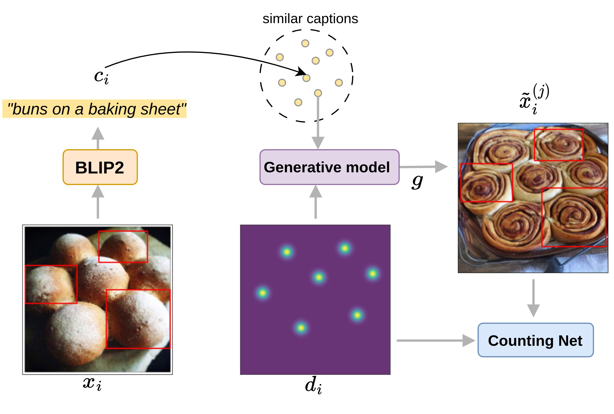
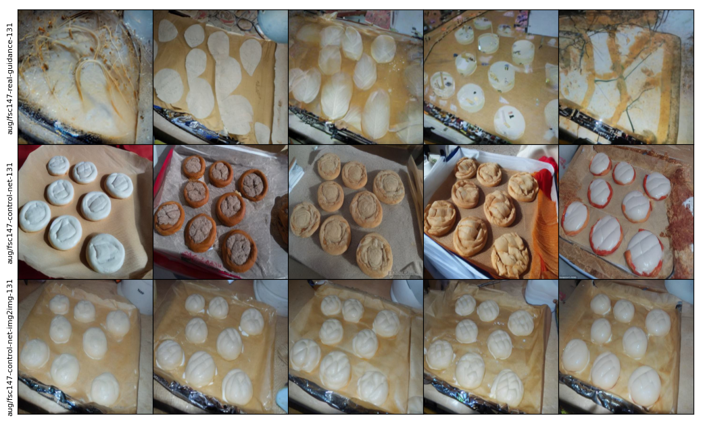

# [WACV 2024] SemAug: Semantic Generative Augmentations for Few-shot Counting

> Perla Doubinsky, Nicolas Audebert, Michel Crucianu, Hervé Le Borgne,
> Conservatoire National des Arts et Métiers (Cnam) & CEA List, France.
>
>With the availability of powerful text-to-image diffusion models, recent works have explored the use of synthetic data to improve image classification performances. These works show that it can effectively augment or even replace real data. In this work, we investigate how synthetic data can benefit few-shot class-agnostic counting. This requires to generate images that correspond to a given input number of objects. However, text-to-image models struggle to grasp the notion of count. We propose to rely on a double conditioning of Stable Diffusion with both a prompt and a density map in order to augment a training dataset for few-shot counting. Due to the small dataset size, the fine-tuned model tends to generate images close to the training images. We propose to enhance the diversity of synthesized images by exchanging captions between images thus creating unseen configurations of object types and spatial layout. Our experiments show that our diversified generation strategy significantly improves the counting accuracy of two recent and performing few-shot counting models on FSC147 and CARPK.
>
>[[arXiv]](https://arxiv.org/abs/2311.16122)
>[[pdf]](https://openaccess.thecvf.com/content/WACV2024/papers/Doubinsky_Semantic_Generative_Augmentations_for_Few-Shot_Counting_WACV_2024_paper.pdf)
>[[2<sup>nd</sup> on Few-shot Counting benchmark]](https://paperswithcode.com/sota/object-counting-on-fsc147)
>

## Use SemAug

### Set up

Create a conda env using the following command:

```bash
conda env create -f environment.yml
conda activate SemAug-xformers
```

### Dataset

We use the [FSC147 dataset](https://openaccess.thecvf.com/content/CVPR2021/papers/Ranjan_Learning_To_Count_Everything_CVPR_2021_paper.pdf). 
You can download it from the following repository: https://github.com/cvlab-stonybrook/LearningToCountEverything

We also use captions for each image generated with [BLIP2](https://github.com/salesforce/LAVIS/tree/main/projects/blip2).
You can download the generated captions and the pre-computed captions similarities using the following link:
https://drive.google.com/drive/folders/1oK2mHCkf3VFtia4cMUNnn7TAo8sPxyne?usp=sharing.

### Generative model with Density Control

You can also find the pre-trained generative model (Stable Diffusion v1.5 with ControlNet finetuning) in the previous link and put in the folder ```ControlNet/pretrained```.

### Generate augmentations 

```bash
python generate_augmentations.py \
    --data_path ../data/FSC147 \
    --dataset fsc147 \
    --aug control-net \
    --model_config ControlNet/models/cldm_v15.yaml \
    --model_path ControlNet/pretrained/blip2_350.ckpt \
    --num_synthetic 5 \
    --guidance_scale 2.0 \
    --swap_captions_prob 0.5 \
    --captions captions/FSC147_captions_blip2_train.npy \
    --captions_sim captions/FSC147_captions_blip2_train_sim_blip2.npy \
    --synthetic_dir aug/cnet-swap-caption-prob-0.5-{dataset}-{seed} 
```

N.B: We use a low guidance scale as we found that using a similar guidance scale as for the unconditional Stable Diffusion model leads to images with very saturated colors.

You can also generate an augmentation from a given real image model (```--aug controlnet-img2img```) for this you need to specify the level of noise to add to the start image ```--t0 (1.0 full noise to 0.0 no noise)```.


Common hyper-parameters are given in the following bash scripts: ```run_generate_aug_controlnet.sh```, ```run_generate_aug_controlnet_img2img.sh```, ```run_generate_aug_controlnet_real_guidance.sh```.

### Notebooks

We provide two notebooks: 
- ```demo_generative_aug.ipynb```: You can generate a single augmentation at a time and alter the caption or the density map.
- ```visualization.ipynb```: You can specify a set of directories containing augmentations from different methods and visualize the results. 

Below, you can see the results for ```real-guidance``` (no conditioning on the density map) vs. our approach ```control-net``` not starting from the real image (2<sup>nd</sup> line) or ```control-net-img2img``` starting from the real image (3<sup>rd</sup> line).



### Trainexi Counting Networks

Code coming soon


### Acknowledgements

This code is based upon: [DAFusion](https://github.com/brandontrabucco/da-fusion), [ControlNet](https://github.com/lllyasviel/ControlNet).

This was also made possible by the use of the FactoryIA supercomputer, financially supported by the Ile-De-France Regional Council.


## Citation 
```bibtex
@inproceedings{doubinsky2024semantic,
  title={Semantic Generative Augmentations for Few-Shot Counting},
  author={Doubinsky, Perla and Audebert, Nicolas and Crucianu, Michel and Le Borgne, Herv{\'e}},
  booktitle={Proceedings of the IEEE/CVF Winter Conference on Applications of Computer Vision},
  pages={5443--5452},
  year={2024}
}
```


